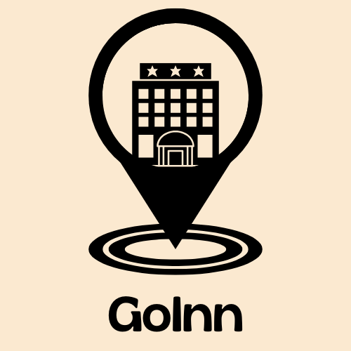
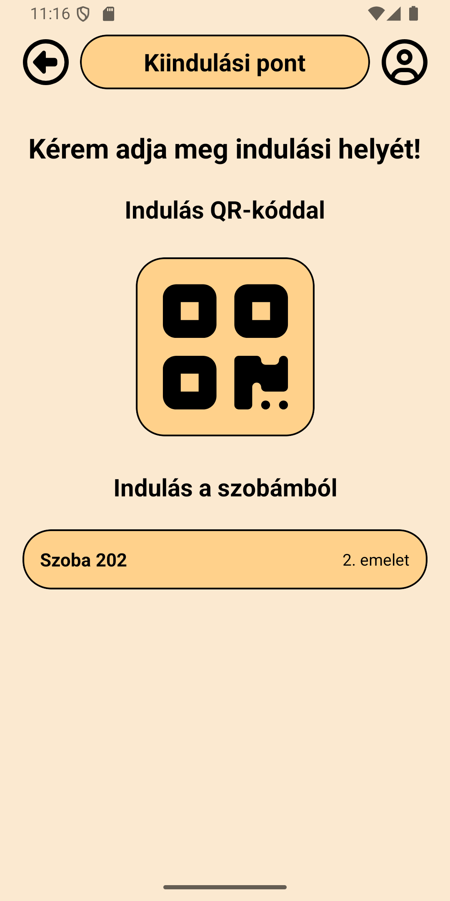
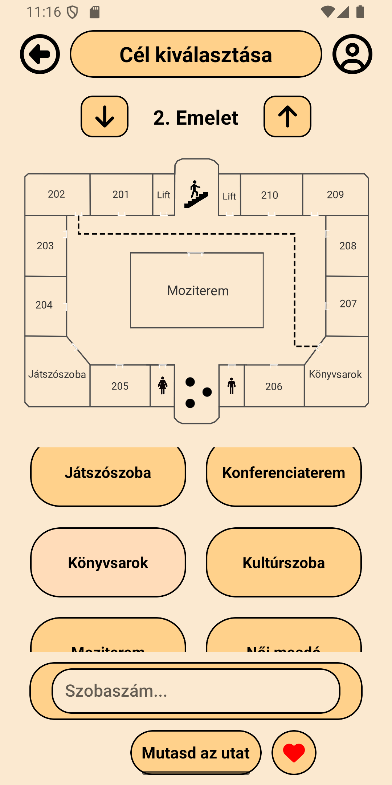
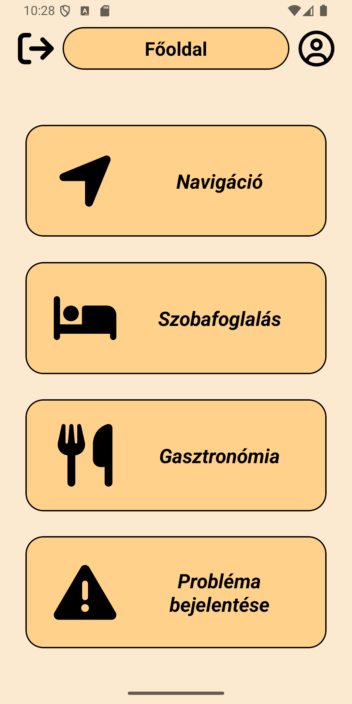

# 📱GoInn - Indoor Navigation Mobile App

<p align="center">
  <span style="border-radius: 10px; overflow: hidden; display: inline-block;">
  
</span>
  <br>
  <b>An intelligent indoor navigation solution powered by QR codes and A* algorithm.</b>
  <br>
  <!-- 
   -->
</p>
 
 ---

<details open>
  <summary><b>🇬🇧 English Version (Click to collapse)</b></summary>
  <br />

A modern **React Native-based mobile application** providing indoor navigation using QR code-based start points and intelligent pathfinding.

---

## 🚀 Key Features

* 📍 **QR Code-Based Positioning**
* 🧭 **A*** **Algorithm-Based Pathfinding**
* 🗺️ **SVG-Based Map Visualization**
* ❤️ **Save favorite routes**
* 🕘 **Reload previous routes**
* 🏨 **Hotel services integration**

  * Room booking
  * Gastronomy (menu, drink menu)
  * Program recommendations (planned feature)

<br />

  <div align="center">
  <span style="border-radius: 10px; overflow: hidden; display: inline-block; margin: 5px;">
    
  </span>
  <span style="border-radius: 10px; overflow: hidden; display: inline-block; margin: 5px;">
    
  </span>
  <span style="border-radius: 10px; overflow: hidden; display: inline-block; margin: 5px;">
    
  </span>
</div>

---

## 🛠️ Technologies

* React Native
* TypeScript
* Firebase (Auth + Firestore)
* SVG rendering
* A* algoritmus

---

## 📂 Project structure (briefly)

```
src/
 ├── screens/        # Screens (Login, Target, Booking, stb.)
 ├── components/     # Reusable UI elements
 ├── store/          # Graph data (graphData.ts)
 ├── algorithms/     # Algorithms (A*)
 └── assets/         # Images, SVGs
```

---

## ⚙️ Installation & Usage

### 1. Clone the repository

```sh
git clone <repo-url>
cd <project-folder>
```

### 2. Install dependencies

```sh
npm install
```

### 3. Start Metro

```sh
npm start
```

### 4. Run the application

#### Android

```sh
npm run android
```

---

## 🧠 How it works (briefly)

How the application works:

1. User scans a QR code → this becomes the **start point**
2. Selects a destination
3. The app calculates the shortest path using the **A*** **algorithm**
4. The route is displayed on an **SVG map**

---

## 🔐 Legal Information

```
Copyright (c) [2024] Horváth Marcell. All rights reserved. 
This project is for portfolio and demonstration purposes only. 
It may not be copied, distributed, or modified without explicit permission.
```

---

## ⚠️ Disclaimer

This project is not open-source. It is intended for portfolio and demonstration purposes only.

---

## 👤 Author

**Horváth Marcell**

---

## ⭐ Future Roadmap

* Disabled access mode fine-tuning
* Multi-level navigation optimization
* AI-based recommendation system for hotel services
* iOS support

  </details>

<br />

<details>
  <summary><b>🇭🇺 Magyar leírás (Kattints a megnyitáshoz)</b></summary>
  <br />

Egy modern **React Native alapú mobilalkalmazás**, amely beltéri navigációt biztosít QR-kód alapú kiindulóponttal és intelligens útvonaltervezéssel.

---

## 🚀 Funkciók

* 📍 **QR-kód alapú pozíció meghatározás**
* 🧭 **A*** **algoritmus alapú útvonaltervezés**
* 🗺️ **SVG-alapú térkép megjelenítés**
* ❤️ **Kedvenc útvonalak mentése**
* 🕘 **Korábbi útvonalak visszatöltése**
* 🏨 **Szállodai szolgáltatások integrációja**

  * Szobafoglalás
  * Gasztronómia (étlap, itallap)
  * Programajánló (tervezett funkció)

<br />

  <div align="center">
  <span style="border-radius: 10px; overflow: hidden; display: inline-block; margin: 5px;">
    
  </span>
  <span style="border-radius: 10px; overflow: hidden; display: inline-block; margin: 5px;">
    
  </span>
  <span style="border-radius: 10px; overflow: hidden; display: inline-block; margin: 5px;">
    
  </span>
</div>

---

## 🛠️ Technológiák

* React Native
* TypeScript
* Firebase (Auth + Firestore)
* SVG rendering
* A* algoritmus

---

## 📂 Projekt struktúra (röviden)

```
src/
 ├── screens/        # Képernyők (Login, Target, Booking, stb.)
 ├── components/     # Újrafelhasználható UI elemek
 ├── store/          # Gráf adatok (graphData.ts)
 ├── algorithms/     # Algoritmusok (A*)
 └── assets/         # Képek, SVG-k
```

---

## ⚙️ Telepítés és futtatás

### 1. Klónozás

```sh
git clone <repo-url>
cd <project-folder>
```

### 2. Függőségek telepítése

```sh
npm install
```

### 3. Metro indítása

```sh
npm start
```

### 4. Alkalmazás futtatása

#### Android

```sh
npm run android
```

---

## 🧠 Működés röviden

Az alkalmazás működése:

1. A felhasználó QR-kódot olvas be → ez lesz a **start pont**
2. Kiválaszt egy célt
3. Az alkalmazás az **A* algoritmus segítségével kiszámolja a legrövidebb útvonalat**
4. Az útvonal egy **SVG térképen jelenik meg**

---

## 🔐 Jogi információ

```
Copyright (c) [2024] Horváth Marcell. All rights reserved. 
This project is for portfolio and demonstration purposes only. 
It may not be copied, distributed, or modified without explicit permission.
```

---

## ⚠️ Megjegyzés

Ez a projekt **nem open-source**, kizárólag bemutatási és portfólió célokra készült.

---

## 👤 Készítette

**Horváth Marcell**

---

## ⭐ További fejlesztési lehetőségek

* Mozgássérült mód finomhangolása
* Többszintes navigáció optimalizálása
* AI-alapú programajánló rendszer
* iOS támogatás

</details>